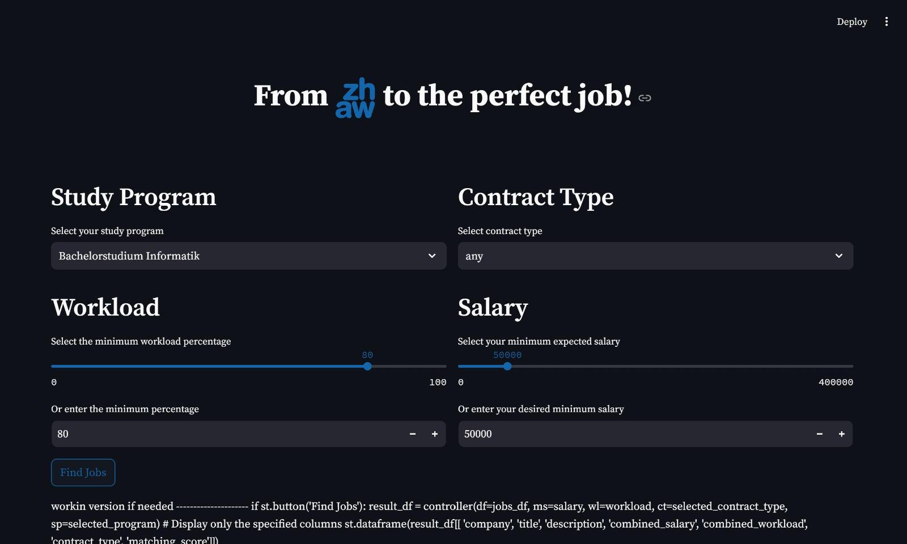

# Job Market Analysis 

<!--
Change `sample` to the respective project name in
* filename of .yml file
* environment name in .yml-file
* in the commands below

Adapted the `LICENSE` as required.

Provide a brief description of the project here.
-->
This project matches students to Zurich region tech jobs based on their [ZHAW](https://www.zhaw.ch/en/university/) degree, salary expectations and preferred workload percentage.

## Python Environment Setup and Management
**Install** conda environment:
```sh
$ conda env create -f jobMarket.yml
```
**Update** the environment with new packages/versions:
1. modify template.yml
2. run `conda env update`:
```sh
$ conda env update --name jobMarket --file jobMarket.yml --prune
```
`prune` uninstalls dependencies which were removed from sample.yml

**Use** environment:
before working on the project always make sure you have the environment activated:
```sh
$ conda activate jobMarket
```

**Check the version** of a specific package (e.g. `html5lib`) in the environment:
```sh
$ conda list scipy
```

**Export** an environment file across platforms:
Include only the packages that were specifically installed. Dependencies will be resolved upon installation
```sh
$ conda env export --from-history > jobMarket.yml
```

**List** all installed environments:
From the base environment run
```sh
$ conda info --envs
```

**Remove** environment:
```sh
$ conda env remove -n jobMarket
```

See the complete documentation on [managing conda-environments](https://docs.conda.io/projects/conda/en/latest/user-guide/tasks/manage-environments.html).

## Runtime Configuration with Environment Variables
The environment variables are specified in a .env-File, which is never commited into version control, as it may contain secrets. The repo just contains the file `.env.template` to demonstrate how environment variables are specified.

You have to create a local copy of `.env.template` in the project root folder and the easiest is to just rename it to `.env`.

The content of the .env-file is then read by the pypi-dependency: `python-dotenv`. Usage:
```python
import os
from dotenv import load_dotenv
```

`load_dotenv` reads the .env-file and sets the environment variables:

```python
load_dotenv()
```

which can then be accessed (assuming the file contains a line `SAMPLE_VAR=<some value>`):

```python
os.environ['SAMPLE_VAR']
```

## Project Organisation
According to [Is It Ops That Make Data Science Scientific? Archives of Data Science, Series A, vol 8, p. 12, 2022.](https://publikationen.bibliothek.kit.edu/1000150238/152958955)


Code and configurations used in the different project phases are stored in the subfolders
* `data_acquisition`
* `eda`
* `modelling`
* `deployment`

Artefacts from the different project phases are provided in the subfolder `docs`:
* Project charta
* Data report
* Modelling report
* Evaluation decision log

## Further Information
* "About Readmes" on Github
https://docs.github.com/en/repositories/managing-your-repositorys-settings-and-features/customizing-your-repository/about-readmes
* [Python Dev Guide](refs/python_dev_guide.md)

### API Keys
All API keys included in this project were burnt before publishing.
