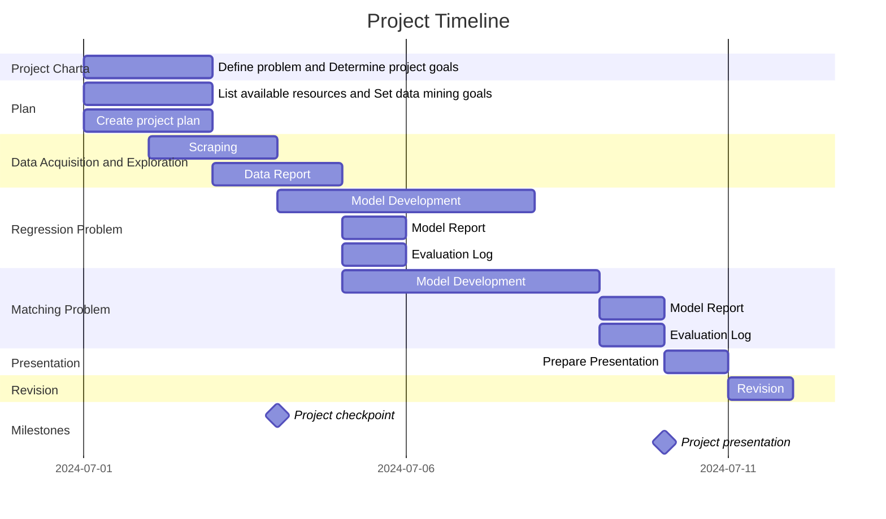

# `Sample Project` - Project Charta
<!--- Content Based Job Filtration System-->

## Problem Definition
Formulate the problem and important information about the domain and/or business area in which the product is to be developed: What exactly is the problem and the expected benefit of the project? Why should we undertake this effort?:

Students often lack clear insights into the job market, making it difficult for them to understand where they can apply their skills and what opportunities are available. Existing career resources are often outdated/not specific enough to provide insights, especially in Zürich. Our product provides students with a curated job selection that aligns closest to their skills and certifications.

<!---
This includes a summary of the most important findings from the user analysis: relevant segments and user groups. Describe the problems and needs of the users of the product to be developed. 
-->
## User Analysis

Students from ZHAW: 
- Students struggling finding jobs, our product finds jobs relevent to their field. 
- Students also struggle understanding the standard pay is for their job.

<!---
Schools:
- Adjusting the curiculum to changes in the job market.

Employers:
- Faster hiring to posting time and reduced hiring costs.

Stakeholders: List the people involved in and affected by the project. Describe their goals and relationships with each other. Visualisation in the form of a stakeholder map can provide a quick overview.
-->
## Stakeholders:
- JobCloud AG: Providing the Data for our product.
- Students: Customers of our product.

<!---
- Schools: Customers of our project.
- Employers: Hire new, quality, employees as fast as possible. In addition, they provide data to JobCloud AG.

You can reference more detailed analyses such as individual "personas" or interviews in separate documents in the appendix.
-->

## Situation Assessment
### Personnel
- Gian Würgler
- Melina Otth
- Dillon Moesch
- Elijah Morgan

### Material
- Laptops
- Internet 
<!-- ^^^ We didn't really know what to put here. ^^^ -->

### Software
- Python 3.11+
- Visual Studio Code
- BeautifulSoup
- mydata-python
- word2vec
<!--- SQL, MySQL, etc? -->

<!---
Describe the available resources (personnel, material, (software) tools, infrastructure, etc.) and time as well as restrictions and constraints. Possible risks that may arise during the project are also identified.
-->

## Project Goals and Success Criteria
<!---
When is the project successful from a client/stakeholder perspective: Formulate (qualitative) objectives, wherever possible, corresponding key metrics and the target values to be achieved within the project.

It is also often helpful to specify what is explicitly excluded from the project objectives (out of scope).
-->
### Goals
<!--- TODO Subject to change, Python is slow. -->
- Find the best matches according to: job field, certifications, and years of experience.
- Factors declaring the best match: Skill matching requierments in %, Jobs.ch lisiting order, salary (descending)
- Runtime of 10 seconds or less.
- Application size under 50mb.
<!--- TODO Change this ^^^ -->
- Predict salaries within 10,000 CHF per year.

### Out of Scope
- Providing benefits/services to employers and schools.
- Dedicated database server.
- Consistent database updates.
- Distance or location preferences.
- User Interface.
- Regions other than Zurich.

### Data Mining Goals
- Regression: Salary Prediction based on workload percentage and company.
  - Measuerment: MSE
- Matching: Vectorization/Embedding of job descriptions and program descriptions.
   - Measuerment: Similarity score. 

<!---
Map the problem definition, datasets to be used and primary objective onto a data mining task, e.g.:

* Classification
* Regression
* Clustering
* Outlier Detection
* Association rule learning (market basket analysis)
* Recommender System
* Visualisation
* ...

Along with the definition of the actual technical problem (category) to be solved, 
the project goals must be mapped onto quitable quantitative metrics and corresponding target values. For example, for a classification task one might specify an *F-score* of 0.9 as a minimal requirement for an acceptable solution.  
Such a requirement should be aligned with the overall project goals and/or literature references or justified by other references, respectively.
-->

## Project Plan

<!---
Divide the project into individual phases, describe them briefly and draw up a preliminary timetable, e.g. as a Gantt chart:
Ranking Matching: Type of Job? -> Skills -> Prefrences -> Salary -->

See [Mermaid syntax for Gantt charts](https://mermaid.js.org/syntax/gantt.html).

## Roles and Contact Details
List the people involved in the development work here with their role titles, tasks and contact details
